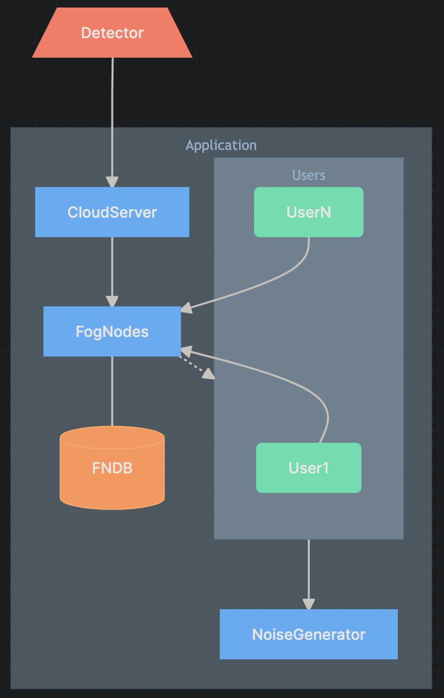

# Privacy-Preserving Smart Electrical Grid

This project is an implementation of the paper with the same name, which targets a means of preserving user privacy through theft-detection techniques. Included is everything outside of the detector and its included ML model, which cannot be trained due to lack of data.

## Table of Contents

- [Privacy-Preserving Smart Electrical Grid](#privacy-preserving-smart-electrical-grid)
  - [Table of Contents](#table-of-contents)
- [Design](#design)
  - [Updated Design Diagram](#updated-design-diagram)
  - [Implementation Details](#implementation-details)
    - [Users](#users)
    - [Database](#database)
- [Usage](#usage)
  - [Requesting Data](#requesting-data)
  - [Running Individual Services](#running-individual-services)


---

# Design

For the most part, this project follows the design outlined in the paper. However there are some small improvements from the original design:

- The original design has the FogNodes reach out to both the users and the NoiseGenerator to get the usage data. Instead, for this implementation, we have optimized this process by having the FogNodes only reach out to the users directly.
- In order for the FogNodes to be able to reach out to the users, we have implemented a simple REST API for the users to send their usage data to the FogNodes. This happens continuously on a timer so that when a new user comes online, they can "register" with the FogNodes even if some of the requests fail initially.
  - Once the FogNodes successfully receive a request from a User, they will add that User to their list of known Users (in the database).
- The original design also has the Users wait to send data until they receive the noise from the NoiseGenerator. This is not necessary, as the NoiseGenerator can send the noise to the Users directly, and the Users can then send the usage data to the FogNodes upon request.
  - To implement this, we simply have the Users reach out to the NoiseGenerator directly to get the noise on a timer and store it.

## Updated Design Diagram



## Implementation Details

### Users

For the users we spawn them at random via the NodeJS service and have them reach out to the FogNodes to register themselves. Once they are registered, they will get their noise data from the NoiseGenerator on a timer.

Additionally, we simulate all the users via one NodeJS service. This is done to make it easier to scale the number of users, as we can simply spawn more instances of the User class and have them all reach out to the FogNodes to register themselves.

### Database

The database is a single PGSQL database that is used to store the data for the Users, FogNodes, and NoiseGenerator. The single DB is for ease-of-use, but in a real-world scenario, we would have a separate DB for each of these services.

---

# Usage

To run this project, you will need to have Docker and Docker Compose installed. Once you have those installed, you can run the following command to start the project:

```bash
make up
```

This will start everything and the logs should scroll in your terminal once the project starts running.

Ctrl|Cmd+C will stop the project.

## Requesting Data

As in the paper, a detector would subscribe to the Cloud Server to get data about energy usage. To do this, you can make a request to `http://localhost:3000/api/v1/energy/usage`

```bash
curl -X GET http://localhost:3000/api/v1/energy/usage
```

I recommend however to use a tool like postman to make the request to the server, as it will make it easier to see and look through the response.

## Running Individual Services

If you want to run an individual service, you can do so by running the following command:

```bash
docker compose up <service_name>
```

Where `<service_name>` is the name of the service you want to run. For example, to run the Cloud Server, you would run:

```bash
docker compose up cloud-server
```

This will start the service and the logs should scroll in your terminal once the project starts running.

Ctrl|Cmd+C will stop the service.